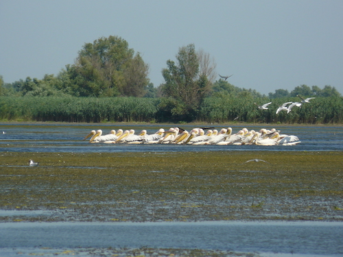

Danube Delta
============

`Honza Javorek <https://github.com/honzajavorek/>`__'s `Pelican <http://www.getpelican.com/>`__ setup.

|PyPI version| |Build Status|

Installation
------------

.. code:: shell

    $ pip install danube-delta

**Warning:** The library is only for Python 3.

Setup
-----

#.  Create basic scaffolding of your `Pelican <http://www.getpelican.com/>`__ blog:

    .. code:: shell

        $ mkdir ./my-awesome-blog
        $ cd ./my-awesome-blog
        $ git init
        $ mkdir ./content ./output
        $ echo '/output' > .gitignore

#.  Create ``./settings.py``:

    .. code:: python

        from danube_delta.settings import *

        AUTHOR = 'Zuzka & Honza'
        SITENAME = 'Pražení'

        if PRODUCTION:
            SITEURL = 'http://example.com'

#.  Install ``danube_delta``, globally:

    .. code:: shell

        $ sudo -H pip install danube_delta

#.  In the root of your blog directory you can now use the ``blog`` CLI:

    .. code:: shell

        $ blog write

Usage
-----

.. code:: shell

    $ blog update   # Gets other people's changes from GitHub
    $ blog write    # Starts a new article
    $ blog photos   # Adds images to the last article
    $ blog preview  # Opens local preview of your blog website
    $ blog publish  # Saves changes and sends them to GitHub
    $ blog lint     # Looks for errors in source code of your blog
    $ blog deploy   # Uploads new version of the blog website

`Travis CI <https://docs.travis-ci.com/user/deployment/>`__ can do ``blog deploy`` for you every time you perform ``blog publish``:

.. code:: yaml

    language: "python"
    python:
        - "3.5"
    cache: "pip"
    script:
        - "blog lint"
    env:
      global:
        - secure: "..."  # gem install travis && travis encrypt GITHUB_TOKEN=...
    deploy:
        provider: "script"
        script: "blog deploy"
        on:
            branch: "master"
            repo: "honzajavorek/my-awesome-blog"
    sudo: false

Head to the `user guide <https://github.com/honzajavorek/danube-delta/blob/master/user-guide.rst>`__ for more information on how to use a blog based on Danube Delta.

Developing Danube Delta
-----------------------

#.  Clone Danube Delta to a directory of your choice, e.g. ``~/danube-delta``.
#.  Install Danube Delta from your local clone: ``pip install -e ~/danube-delta``.

Name
----

In 2012 I've seen some `pelicans <https://en.wikipedia.org/wiki/Pelican>`__ in the `Danube Delta <https://en.wikipedia.org/wiki/Danube_Delta>`__:

    Photo: © 2012 Honza Javorek

.. |PyPI version| image:: https://badge.fury.io/py/danube-delta.svg
    :target: https://badge.fury.io/py/danube-delta
.. |Build Status| image:: https://travis-ci.org/honzajavorek/danube-delta.svg?branch=master
    :target: https://travis-ci.org/honzajavorek/danube-delta
